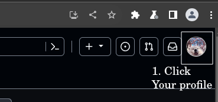
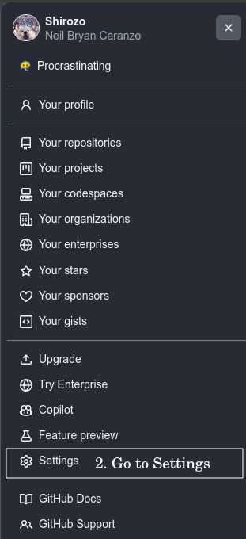
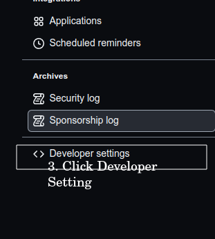
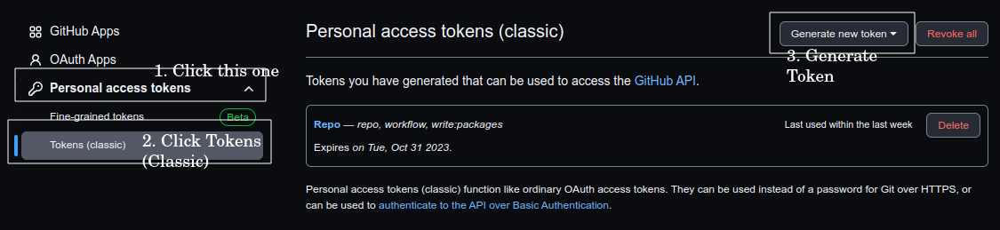
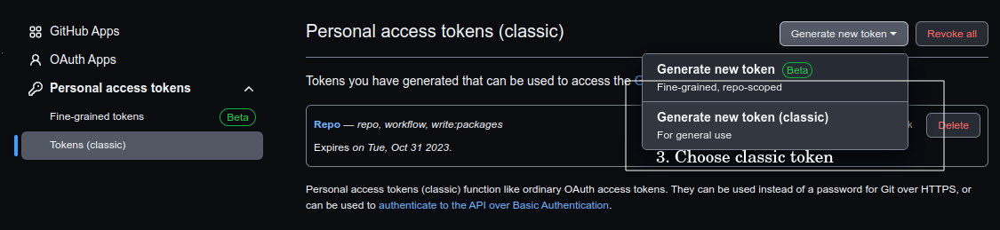
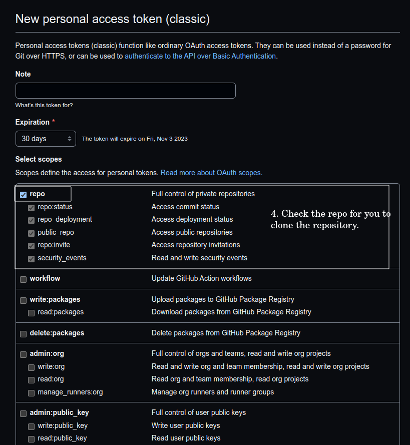
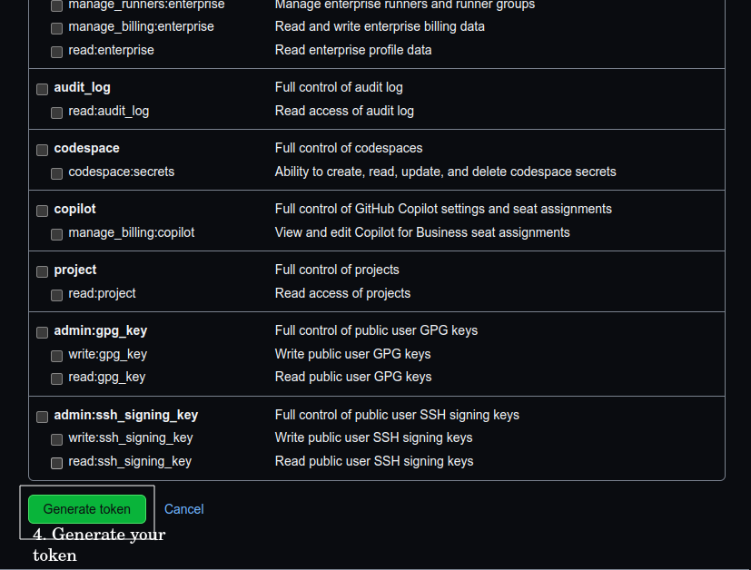
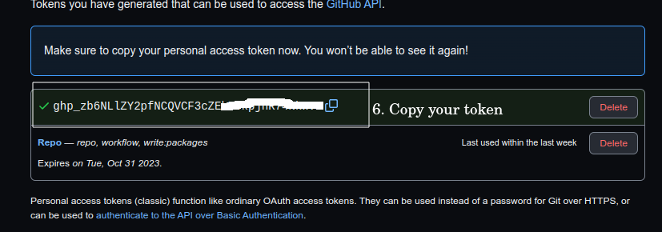
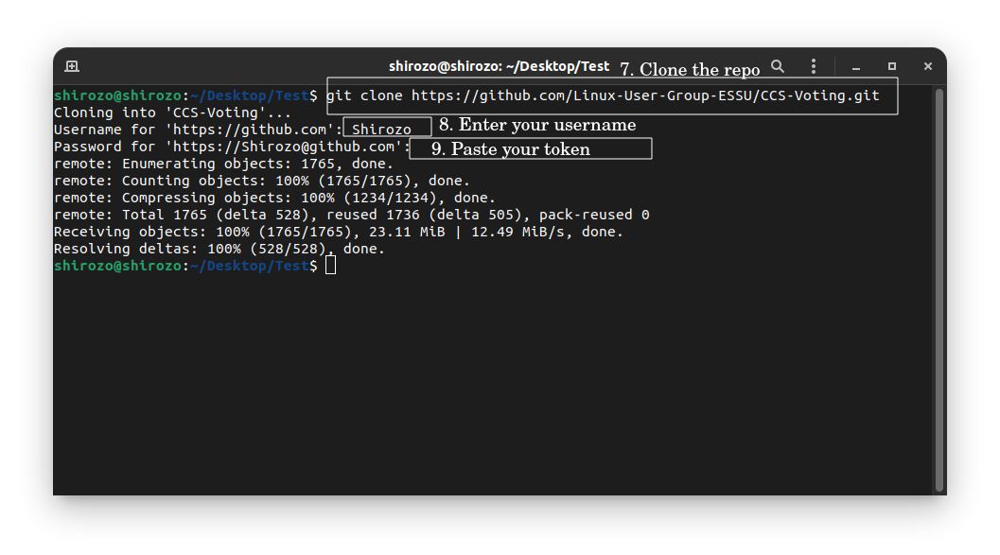

# CCS-Voting
A voting system for CCS.

# Setting up github in terminal 
[Setting up your account](https://docs.github.com/en/get-started/quickstart/set-up-git)

# Cloning
1. On [Github](github.com) click your profile.

   

2. Click `Settings`.

   

3. Click `Developer Settings`.

   

4. Click `Personal Access token`.

   

5. Click `Generate Token`.

  

6. Check the `repo`.

   

7. Click `Generate token`.

  

8. Copy your token.

   

9. Use your token when ask for a password in cloning.

    

# After cloning the repo run on terminal:
1. `cd CCS-Voting`
2. Create the migration\
   a. linux: `python3 manage.py makemigrations`\
   b. Windows: `python manage.py makemigrations`\
   c. MacOs: `Mali ka ada han im nakadian`
3. Migrate\
   a. linux: `python3 manage.py migrate`\
   b. Windows: `python manage.py migrate`\
   c. MacOs: `Ano nga yadi ka pa???`
4. Run the server\
   a. linux: `python3 manage.py runserver`\
   b. Windows: `python3 manage.py runserver`\
   c. MacOs: `Wara didi kanan Mac. Uli nala!`
